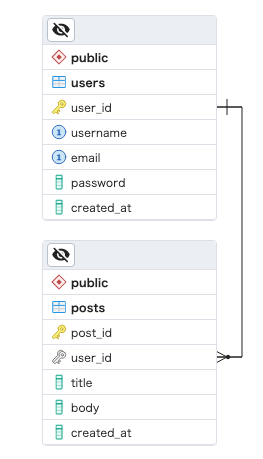

# README

Hasura を PostgreSQL のバックエンドで動かすためのローカル検証環境の構築を行う参考資料。

PostgreSQL では posts, users の2つのテーブルを持ち、 posts.`user_id` -> users.`id` の外部キー制約を持つ。



## Usage

基本的には [Hasura 公式の手順](https://hasura.io/docs/latest/getting-started/docker-simple/)参照でOK。

`docker-compose.yml` は公式提供のものがあるのでそれをベースにする。

ただし、今回はバックエンドの PostgreSQL に初期データを投入するため、その点のみ変更が必要。

```yaml
# ...
services:
  postgres:
    image: postgres:15
    restart: always
    ports:
      - "5432:5432"
    volumes:
      - db_data:/var/lib/postgresql/data
      - ./initdb:/docker-entrypoint-initdb.d # 追加
    # ...
```

### Start

サービスの起動

```bash
# exec on container host
$ docker compose up
```

実際に DB の中を確認してみたい場合は以下のようにして postgres コンテナ内のシェルを起動する。

```bash
$ docker compose exec postgres bash

# exec on postgres container shell
$ psql -U postgres -d postgres 
```

もし pgAdmin などで見たい場合は、postgres コンテナのポートをホストに公開する必要があるので `docker-compose.yml` に以下のような追記が必要

```yaml
    ports:
      - "5432:5432"
```

サービスが起動すると `http://localhost:8080` で Hasura のコンソール画面が開かれるので、そこで諸々操作を行う。

(1) DB の接続設定

公式の [Step 2: Connect a database](https://hasura.io/docs/latest/getting-started/docker-simple/#step-2-connect-a-database) の通り。

ここでは `docker-compose.yml` で指定している DATABASE_URL の値があるので、それを使う。

(2) テーブル・リレーションを Hasura に認識させる

今回は `public` スキーマの下にテーブルを作成しているので、`public` スキーマの配下にあるテーブルを Hasura に認識させる。

概念としては、おおよそ次のような対応関係があると捉えてよい。

| GraphQL | Hasura | PostgreSQL |
| :--- | :--- | :--- |
| フィールド（トップレベル） | "Tracked tables and views" | テーブル |
| フィールド（ネスト） | "Untracked foreign-key relationships" | テーブル内の外部キー制約（の参照先テーブル） |

バックエンドDB が持つデータ構造すべてが無条件に Hasura (GraphQL) のサービスに連携され公開されるわけではなく、ユーザー自身が選べるようになっている。そのための設定が "Tracked tables and views" や　"Untracked foreign-key relationships" である。PostgreSQL をバックエンドに使用するならば「どのテーブルと外部キーを Hasura に追跡させるか (= GraphQL のフィールドとして使えるようにするか)」を設定するものと置き換えて理解するとよい
